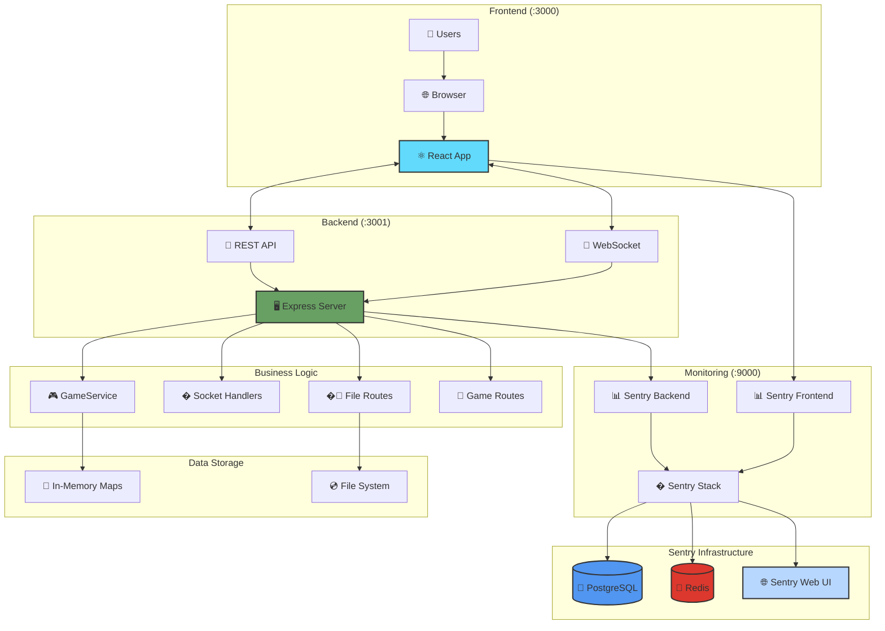
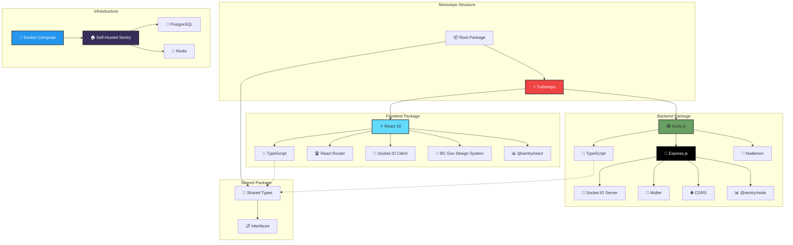
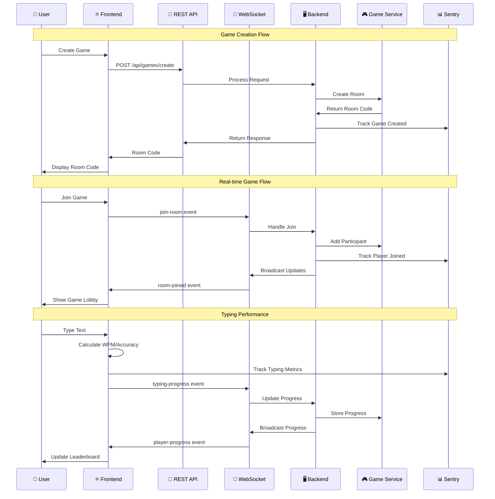
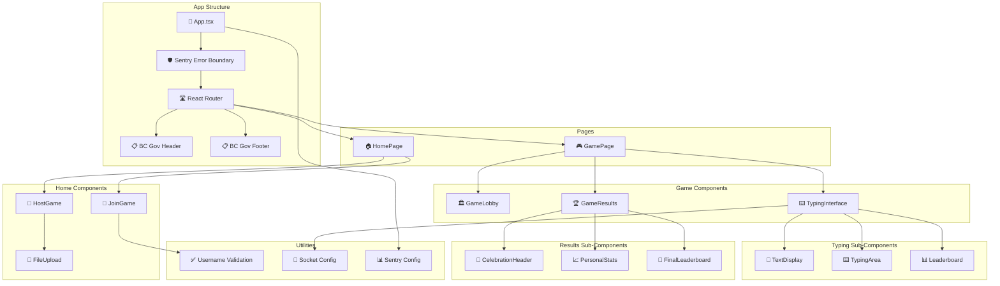
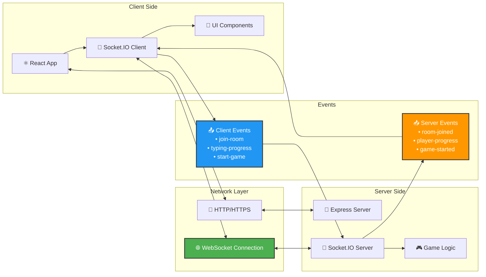
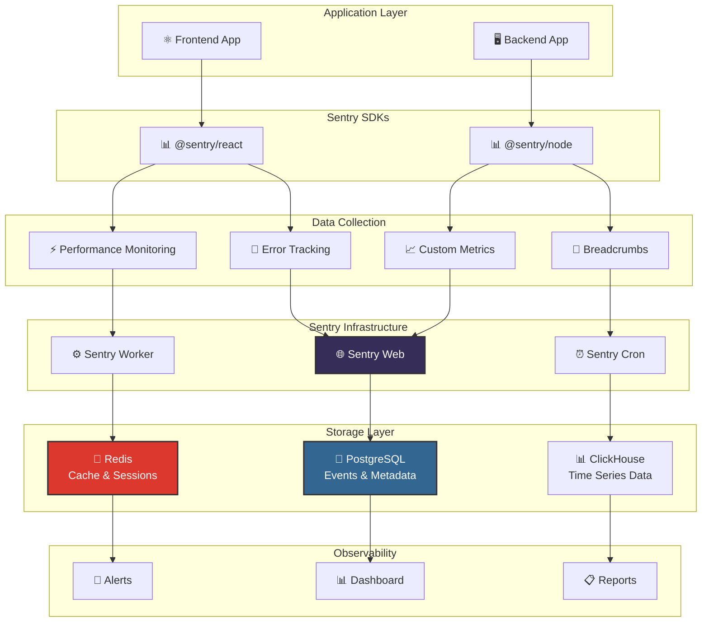
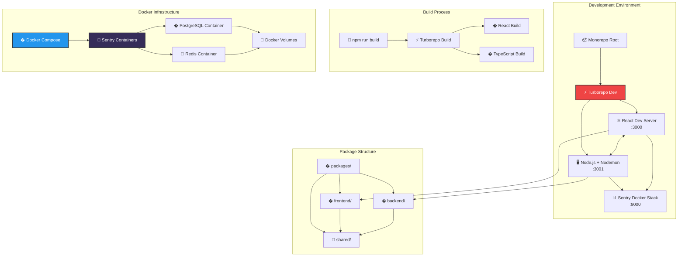

# TypeRacer Architecture

## System Overview



## Tech Stack



## Data Flow



## Frontend Components



## Layered Architecture

```mermaid
graph TB
    subgraph "Frontend Layer"
        UI[🎨 React Components]
        PAGES[📄 Pages]
        HOOKS[🪝 React Hooks]
        STATE[🔄 State Management]
    end
    
    subgraph "API Layer"
        REST[🌐 REST Routes]
        WEBSOCKET[🔌 WebSocket Events]
        MIDDLEWARE[⚙️ Express Middleware]
        CORS_MW[🌐 CORS Middleware]
    end
    
    subgraph "Business Logic Layer"
        GAME_SERVICE[🎮 GameService]
        SOCKET_HANDLERS[🔌 Socket Handlers]
        GAME_ROUTES[🎯 Game Routes]
        FILE_ROUTES[� File Routes]
    end
    
    subgraph "Data Layer"
        MEMORY_MAPS[💾 In-Memory Maps]
        FILE_SYSTEM[💿 File System (uploads/)]
        SHARED_TYPES[🔗 Shared Types]
    end
    
    subgraph "Infrastructure Layer"
        HTTP_SERVER[🖥️ HTTP Server]
        SOCKET_IO[🔌 Socket.IO Server]
        SENTRY_MONITORING[📊 Sentry Monitoring]
        NODEMON[� Nodemon (dev)]
    end

    UI --> REST
    PAGES --> WEBSOCKET
    
    REST --> GAME_ROUTES
    REST --> FILE_ROUTES
    WEBSOCKET --> SOCKET_HANDLERS
    REST --> CORS_MW
    
    GAME_ROUTES --> GAME_SERVICE
    SOCKET_HANDLERS --> GAME_SERVICE
    FILE_ROUTES --> FILE_SYSTEM
    
    GAME_SERVICE --> MEMORY_MAPS
    GAME_SERVICE --> SHARED_TYPES
    
    MEMORY_MAPS --> HTTP_SERVER
    FILE_SYSTEM --> HTTP_SERVER
    HTTP_SERVER --> SOCKET_IO
    HTTP_SERVER --> SENTRY_MONITORING
    HTTP_SERVER --> NODEMON

    style UI fill:#e1f5fe
    style GAME_SERVICE fill:#f3e5f5
    style MEMORY_MAPS fill:#fff3e0
    style HTTP_SERVER fill:#e8f5e8
```

## Real-time Communication



## Monitoring



## Deployment



## Tech Stack
- **Frontend**: React 18 + TypeScript + Socket.IO Client
- **Backend**: Node.js + Express + Socket.IO Server + TypeScript  
- **Monitoring**: Self-hosted Sentry (PostgreSQL + Redis)
- **Infrastructure**: Docker Compose

