```mermaid
sequenceDiagram
    participant U as 👤 User
    participant F as ⚛️ Frontend
    participant API as 🔌 REST API
    participant WS as 🔄 WebSocket
    participant BE as 🖥️ Backend
    participant GS as 🎮 Game Service
    participant S as 📊 Sentry

    Note over U,S: Game Creation Flow
    U->>F: Create Game
    F->>API: POST /api/games/create
    API->>BE: Process Request
    BE->>GS: Create Room
    GS->>BE: Return Room Code
    BE->>S: Track Game Created
    BE->>API: Return Response
    API->>F: Room Code
    F->>U: Display Room Code

    Note over U,S: Real-time Game Flow
    U->>F: Join Game
    F->>WS: join-room event
    WS->>BE: Handle Join
    BE->>GS: Add Participant
    BE->>S: Track Player Joined
    BE->>WS: Broadcast Updates
    WS->>F: room-joined event
    F->>U: Show Game Lobby

    Note over U,S: Typing Performance
    U->>F: Type Text
    F->>F: Calculate WPM/Accuracy
    F->>S: Track Typing Metrics
    F->>WS: typing-progress event
    WS->>BE: Update Progress
    BE->>GS: Store Progress
    BE->>WS: Broadcast Progress
    WS->>F: player-progress event
    F->>U: Update Leaderboard
```

```mermaid
graph LR
    subgraph "Client Side"
        REACT_APP[⚛️ React App]
        SOCKET_CLIENT[🔌 Socket.IO Client]
        UI_COMPONENTS[🎨 UI Components]
        
        REACT_APP --> SOCKET_CLIENT
        SOCKET_CLIENT --> UI_COMPONENTS
    end
    
    subgraph "Network Layer"
        WEBSOCKET[🌐 WebSocket Connection]
        HTTP[📡 HTTP/HTTPS]
        
        SOCKET_CLIENT <--> WEBSOCKET
        REACT_APP <--> HTTP
    end
    
    subgraph "Server Side"
        EXPRESS_SERVER[🚂 Express Server]
        SOCKET_SERVER[🔌 Socket.IO Server]
        GAME_LOGIC[🎮 Game Logic]
        
        HTTP <--> EXPRESS_SERVER
        WEBSOCKET <--> SOCKET_SERVER
        SOCKET_SERVER --> GAME_LOGIC
    end
    
    subgraph "Events"
        CLIENT_EVENTS[📤 Client Events<br/>• join-room<br/>• typing-progress<br/>• start-game]
        SERVER_EVENTS[📥 Server Events<br/>• room-joined<br/>• player-progress<br/>• game-started]
        
        SOCKET_CLIENT --> CLIENT_EVENTS
        SERVER_EVENTS --> SOCKET_CLIENT
        CLIENT_EVENTS --> SOCKET_SERVER
        SOCKET_SERVER --> SERVER_EVENTS
    end

    style WEBSOCKET fill:#4caf50,stroke:#333,stroke-width:2px,color:#fff
    style CLIENT_EVENTS fill:#2196f3,stroke:#333,stroke-width:2px,color:#fff
    style SERVER_EVENTS fill:#ff9800,stroke:#333,stroke-width:2px,color:#fff
```

```mermaid
graph TB
    subgraph "Application Layer"
        FE[⚛️ Frontend App]
        BE[🖥️ Backend App]
    end
    
    subgraph "Sentry SDKs"
        FE_SDK[📊 @sentry/react]
        BE_SDK[📊 @sentry/node]
        
        FE --> FE_SDK
        BE --> BE_SDK
    end
    
    subgraph "Data Collection"
        ERRORS[🚨 Error Tracking]
        PERFORMANCE[⚡ Performance Monitoring]
        BREADCRUMBS[🍞 Breadcrumbs]
        CUSTOM_METRICS[📈 Custom Metrics]
        
        FE_SDK --> ERRORS
        FE_SDK --> PERFORMANCE
        BE_SDK --> BREADCRUMBS
        BE_SDK --> CUSTOM_METRICS
    end
    
    subgraph "Sentry Infrastructure"
        SENTRY_WEB[🌐 Sentry Web]
        SENTRY_WORKER[⚙️ Sentry Worker]
        SENTRY_CRON[⏰ Sentry Cron]
        
        ERRORS --> SENTRY_WEB
        PERFORMANCE --> SENTRY_WORKER
        BREADCRUMBS --> SENTRY_CRON
        CUSTOM_METRICS --> SENTRY_WEB
    end
    
    subgraph "Storage Layer"
        POSTGRES[🐘 PostgreSQL<br/>Events & Metadata]
        REDIS[🔴 Redis<br/>Cache & Sessions]
        CLICKHOUSE[📊 ClickHouse<br/>Time Series Data]
        
        SENTRY_WEB --> POSTGRES
        SENTRY_WORKER --> REDIS
        SENTRY_CRON --> CLICKHOUSE
    end
    
    subgraph "Observability"
        DASHBOARD[📊 Dashboard]
        ALERTS[🚨 Alerts]
        REPORTS[📋 Reports]
        
        POSTGRES --> DASHBOARD
        REDIS --> ALERTS
        CLICKHOUSE --> REPORTS
    end

    style SENTRY_WEB fill:#362d59,stroke:#333,stroke-width:2px,color:#fff
    style POSTGRES fill:#336791,stroke:#333,stroke-width:2px,color:#fff
    style REDIS fill:#dc382d,stroke:#333,stroke-width:2px,color:#fff
```

# TypeRacer Architecture & Tech Stack
Please note this document is generated by claude-sonnet-4.

## 🏗️ System Architecture Overview

```mermaid
graph TB
    subgraph "Presentation Layer"
        U[👤 Users] --> B[🌐 Browser]
        B --> F[⚛️ React Frontend]
    end
    
    subgraph "Application Layer"
        F <--> API[🔌 REST API]
        F <--> WS[🔄 WebSocket]
        API --> BE[🖥️ Express Backend]
        WS --> BE
    end
    
    subgraph "Business Logic Layer"
        BE --> GS[🎮 Game Service]
        BE --> FS[📁 File Service]
        BE --> SH[🔌 Socket Handlers]
    end
    
    subgraph "Data Layer"
        GS --> MEM[💾 In-Memory Storage]
        FS --> DISK[💿 File System]
    end
    
    subgraph "Monitoring Layer"
        BE --> SENTRY_BE[📊 Sentry Backend]
        F --> SENTRY_FE[📊 Sentry Frontend]
        SENTRY_BE --> SENTRY_DB[(🗄️ Sentry DB)]
        SENTRY_FE --> SENTRY_DB
    end
    
    subgraph "Infrastructure"
        SENTRY_DB --> POSTGRES[(🐘 PostgreSQL)]
        SENTRY_DB --> REDIS[(🔴 Redis)]
        SENTRY_DB --> SENTRY_WEB[🌐 Sentry Web UI]
    end

    style F fill:#61dafb,stroke:#333,stroke-width:2px
    style BE fill:#68a063,stroke:#333,stroke-width:2px
    style SENTRY_WEB fill:#b8d7ff,stroke:#333,stroke-width:2px
    style POSTGRES fill:#5196f0,stroke:#333,stroke-width:2px
    style REDIS fill:#dc382d,stroke:#333,stroke-width:2px
```



## 🔧 Tech Stack Breakdown

```mermaid
graph LR
    subgraph "Frontend Stack"
        REACT[⚛️ React 18]
        TS_FE[📘 TypeScript]
        ROUTER[🛣️ React Router]
        SOCKET_CLIENT[🔌 Socket.IO Client]
        SENTRY_REACT[📊 Sentry React]
        
        REACT --> TS_FE
        REACT --> ROUTER
        REACT --> SOCKET_CLIENT
        REACT --> SENTRY_REACT
    end
    
    subgraph "Backend Stack"
        NODE[🟢 Node.js]
        EXPRESS[🚂 Express.js]
        TS_BE[📘 TypeScript]
        SOCKET_SERVER[🔌 Socket.IO Server]
        MULTER[📎 Multer]
        CORS[🌐 CORS]
        SENTRY_NODE[📊 Sentry Node]
        
        NODE --> EXPRESS
        NODE --> TS_BE
        EXPRESS --> SOCKET_SERVER
        EXPRESS --> MULTER
        EXPRESS --> CORS
        EXPRESS --> SENTRY_NODE
    end
    
    subgraph "Shared"
        SHARED_TYPES[🔗 Shared Types]
        TS_FE -.-> SHARED_TYPES
        TS_BE -.-> SHARED_TYPES
    end
    
    subgraph "Monitoring"
        SENTRY_SELF[🏠 Self-Hosted Sentry]
        POSTGRES_SENTRY[🐘 PostgreSQL]
        REDIS_SENTRY[🔴 Redis]
        DOCKER[🐳 Docker Compose]
        
        SENTRY_SELF --> POSTGRES_SENTRY
        SENTRY_SELF --> REDIS_SENTRY
        DOCKER --> SENTRY_SELF
    end

    style REACT fill:#61dafb,stroke:#333,stroke-width:2px
    style NODE fill:#68a063,stroke:#333,stroke-width:2px
    style EXPRESS fill:#000000,stroke:#333,stroke-width:2px,color:#fff
    style SENTRY_SELF fill:#362d59,stroke:#333,stroke-width:2px,color:#fff
    style DOCKER fill:#2496ed,stroke:#333,stroke-width:2px,color:#fff
```



## 🌊 Data Flow Architecture



## 🎨 Frontend Component Architecture


## 🏛️ Layered Architecture Detail

```mermaid
graph TB
    subgraph "Presentation Layer"
        UI[🎨 UI Components]
        PAGES[📄 Pages]
        HOOKS[🪝 React Hooks]
        STATE[🔄 State Management]
    end
    
    subgraph "API Layer"
        REST[🌐 REST Endpoints]
        WEBSOCKET[🔌 WebSocket Events]
        MIDDLEWARE[⚙️ Middleware]
        VALIDATION[✅ Validation]
    end
    
    subgraph "Business Logic Layer"
        GAME_SERVICE[🎮 Game Service]
        FILE_SERVICE[📁 File Service]
        SOCKET_HANDLERS[🔌 Socket Handlers]
        UTILS[🛠️ Utilities]
    end
    
    subgraph "Data Access Layer"
        MEMORY[💾 In-Memory Store]
        FILE_SYSTEM[💿 File System]
        CACHE[⚡ Cache Layer]
    end
    
    subgraph "Infrastructure Layer"
        SERVER[🖥️ HTTP Server]
        SOCKET_IO[🔌 Socket.IO Server]
        MONITORING[📊 Monitoring]
        LOGGING[📝 Logging]
    end

    UI --> REST
    PAGES --> WEBSOCKET
    HOOKS --> STATE
    
    REST --> GAME_SERVICE
    WEBSOCKET --> SOCKET_HANDLERS
    MIDDLEWARE --> VALIDATION
    
    GAME_SERVICE --> MEMORY
    FILE_SERVICE --> FILE_SYSTEM
    SOCKET_HANDLERS --> CACHE
    
    MEMORY --> SERVER
    FILE_SYSTEM --> SOCKET_IO
    CACHE --> MONITORING
    UTILS --> LOGGING

    style UI fill:#e1f5fe
    style GAME_SERVICE fill:#f3e5f5
    style MEMORY fill:#fff3e0
    style SERVER fill:#e8f5e8
```



## 🔄 Real-time Communication Flow



## 📊 Monitoring Architecture



## 🚀 Deployment Architecture

```mermaid
graph TB
    subgraph "Development Environment"
        DEV_FE[⚛️ React Dev Server<br/>:3000]
        DEV_BE[🖥️ Node.js Dev Server<br/>:3001]
        DEV_SENTRY[📊 Sentry Dev<br/>:9000]
        
        DEV_FE <--> DEV_BE
        DEV_BE --> DEV_SENTRY
        DEV_FE --> DEV_SENTRY
    end
    
    subgraph "Production Environment"
        NGINX[🌐 Nginx<br/>Reverse Proxy]
        PROD_FE[⚛️ React Build<br/>Static Files]
        PROD_BE[🖥️ Node.js Server<br/>PM2 Cluster]
        PROD_SENTRY[📊 Sentry Production<br/>Load Balanced]
        
        NGINX --> PROD_FE
        NGINX --> PROD_BE
        PROD_BE --> PROD_SENTRY
        PROD_FE --> PROD_SENTRY
    end
    
    subgraph "Container Infrastructure"
        DOCKER[🐳 Docker]
        COMPOSE[🐙 Docker Compose]
        VOLUMES[💾 Persistent Volumes]
        
        DEV_SENTRY --> DOCKER
        PROD_SENTRY --> COMPOSE
        COMPOSE --> VOLUMES
    end
    
    subgraph "Monitoring Stack"
        POSTGRES_PROD[🐘 PostgreSQL<br/>Primary DB]
        REDIS_PROD[🔴 Redis<br/>Cache & Queue]
        BACKUP[💾 Backup Storage]
        
        PROD_SENTRY --> POSTGRES_PROD
        PROD_SENTRY --> REDIS_PROD
        POSTGRES_PROD --> BACKUP
    end

    style NGINX fill:#009639,stroke:#333,stroke-width:2px,color:#fff
    style DOCKER fill:#2496ed,stroke:#333,stroke-width:2px,color:#fff
    style COMPOSE fill:#2496ed,stroke:#333,stroke-width:2px,color:#fff
```



## 🧩 Component Composition Patterns

### Design Principles
- **Single Responsibility**: Each component has one clear purpose
- **Composition over Inheritance**: Building complex UIs from simple components
- **Props Interface Design**: Clean, typed interfaces for component communication
- **External CSS**: Separation of styling from component logic
- **Reusability**: Components designed for reuse across the application

### Component Hierarchy

#### Main Game Components
```
TypingInterface (108 lines)
├── TextDisplay (42 lines)
├── TypingArea (56 lines)
└── Leaderboard (40 lines)

GameResults (40 lines)
├── CelebrationHeader (35 lines)
├── PersonalStats (45 lines)
└── FinalLeaderboard (50 lines)

GameLobby (85 lines)
└── External CSS (GameLobby.css)
```

#### Benefits Achieved
- **Reduced Complexity**: Main components are 48-88% smaller
- **Better Maintainability**: Changes isolated to specific components
- **Improved Testability**: Smaller components easier to unit test
- **Enhanced Reusability**: Sub-components can be used independently
- **Cleaner Code**: Separation of concerns and focused responsibilities

### CSS Architecture
- **Component-Scoped CSS**: Each component has its own stylesheet
- **Responsive Design**: Mobile-first approach with media queries
- **Consistent Naming**: BEM-like naming conventions
- **Performance**: External CSS files for better caching
- **Maintainability**: Styles separated from component logic

## 📋 Technology Specifications

### Frontend Technologies
- **React 18**: Modern React with concurrent features
- **TypeScript**: Full type safety and IntelliSense
- **React Router v6**: Client-side routing
- **Socket.IO Client**: Real-time communication
- **CSS3**: Modern styling with Grid and Flexbox
- **Sentry React**: Error tracking and performance monitoring

### Backend Technologies
- **Node.js 16+**: JavaScript runtime
- **Express.js**: Web application framework
- **TypeScript**: Server-side type safety
- **Socket.IO**: Real-time bidirectional communication
- **Multer**: File upload handling
- **CORS**: Cross-origin resource sharing
- **Sentry Node**: Server-side monitoring

### Monitoring & Infrastructure
- **Self-Hosted Sentry**: Complete observability platform
- **PostgreSQL**: Primary database for Sentry
- **Redis**: Caching and session storage
- **Docker Compose**: Container orchestration
- **Hot Reload**: Development productivity tools

### Development Tools
- **nodemon**: Backend hot reload
- **React HMR**: Frontend hot module replacement
- **Shared Types**: Cross-platform type definitions
- **ESLint/Prettier**: Code quality and formatting

## 🏛️ BC Gov Design System

The frontend uses the [BC Gov Design System](https://designsystem.digital.gov.bc.ca/) for UI components and styling:
- Components (Buttons, inputs, form and etc) are imported from `@bcgov/design-system-react-components`.
- Typography and layout use BC Gov design tokens and BC Sans font.
- All interactive and visual elements follow BC Gov accessibility and branding standards.

This ensures a consistent, accessible, and modern user experience across all pages and components.

This architecture provides a scalable, maintainable, and observable real-time multiplayer typing application with comprehensive monitoring capabilities.
